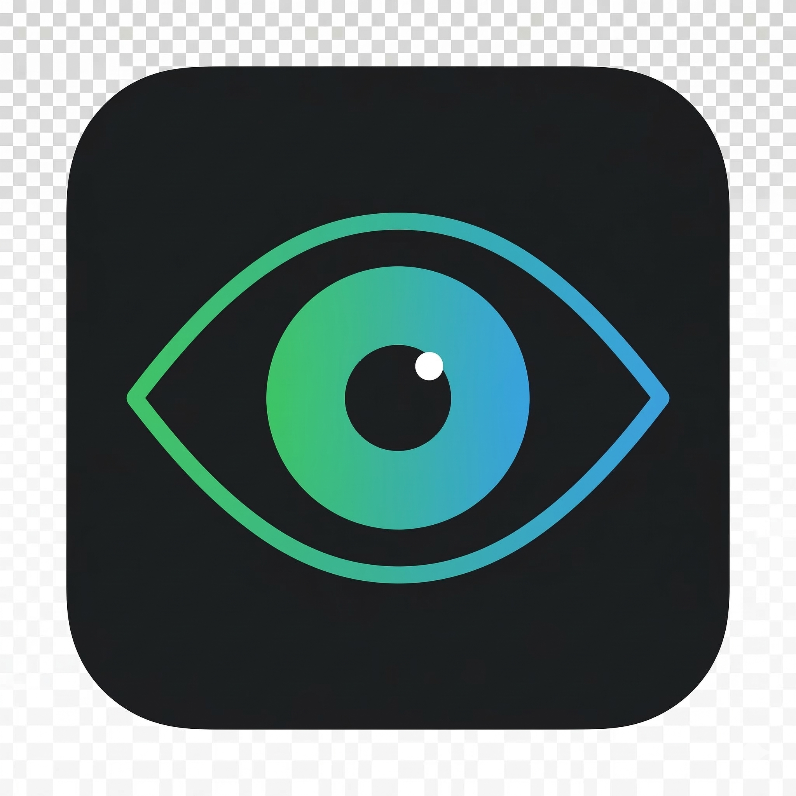

<div align="center">



# BlinkBreak

> A beautiful, open-source Pomodoro eye-care extension for Chrome.

**Rest your eyes. Fix your posture. Stay hydrated.**

[](LICENSE)
[](manifest.json)
[](https://google.com/chrome)
[](https://github.com/Asharibk/Blink-break)

<br/>

[**Installation**](#installation) &nbsp;·&nbsp;
[**How It Works**](#how-it-works) &nbsp;·&nbsp;
[**Contributing**](#contributing) &nbsp;·&nbsp;
[**Roadmap**](#roadmap)

</div>

---

## What is BlinkBreak?

BlinkBreak is a free, open-source Chrome extension that reminds you to take regular eye breaks while working at your computer.

It combines the **Pomodoro Technique** with the **20-20-20 eye-care rule** — every 25 minutes, a beautiful frosted-glass overlay appears across all your open tabs with a simple wellness tip. When the break ends, the next session starts automatically.

**This project is open to everyone.** Whether you want to fix a bug, improve the design, or suggest a new feature — all contributions are welcome.

---

## Features

| Feature | Description |
|---|---|
| ⏱ Pomodoro Timer | 25 min work · 5 min break · fully customisable |
| 👁 Eye-Care Routines | Look Away, Blink Slowly, Check Posture, Stay Hydrated |
| 🖥 All-Tab Coverage | Break overlay appears on every open tab simultaneously |
| 🔔 Live Badge | Toolbar countdown updates every minute |
| ⏸ Session Control | Pause, Resume, Snooze on demand |
| 🌑 Apple-Style UI | Frosted glass overlay, dark theme, smooth animations |
| 🔋 Battery Friendly | Works with Chrome's Energy Saver and Memory Saver modes |
| 🔓 Open Source | MIT licensed · free forever · no tracking |

---

## Installation

### Developer Mode (from source)

```bash
git clone https://github.com/Asharibk/Blink-break.git
```

1. Open Chrome and navigate to `chrome://extensions`
2. Enable **Developer mode** using the toggle in the top-right corner
3. Click **Load unpacked**
4. Select the cloned `Blink-break` folder
5. Click the **puzzle piece icon** in the Chrome toolbar and pin BlinkBreak

> The toolbar badge shows a live countdown to your next break once a session is started.

---

## How It Works

```
Start Session → Work 25 min → Break Overlay Appears → Follow Tip → Skip or Snooze → Repeat
```

1. Click the **BlinkBreak icon** in your toolbar
2. Set your **Work Interval** (default: 25 min) and **Break Duration** (default: 300 sec)
3. Click **Start Focus Session**
4. Work until the frosted-glass overlay appears across all your tabs
5. Follow the wellness tip, then click **Skip** or **Snooze 5m**
6. The next session starts automatically

---

## Project Structure

```
Blink-break/
│
├── manifest.json       # Extension configuration (Manifest V3)
├── background.js       # Service worker — timer, alarms, state
├── content.js          # Injected into every tab — overlay logic
│
├── popup.html          # Toolbar popup UI
├── popup.js            # Popup countdown and controls
│
├── newtab.html         # Custom new tab page (clock + search)
│
├── welcome.html        # Onboarding page shown on first install
├── welcome.js          # Onboarding button handler
│
└── icons/
    └── icon.png        # Extension icon (128 × 128 px)
```

---

## Roadmap

> Have an idea? [Open an issue](https://github.com/Asharibk/Blink-break/issues) and let's discuss it.

- [ ] Publish to the Chrome Web Store
- [ ] Custom wellness routines
- [ ] Sound / notification alerts
- [ ] Session history and stats
- [ ] Light theme option
- [ ] Firefox support
- [ ] Keyboard shortcuts

---

## Contributing

Contributions of any size are welcome — from fixing a typo to building a new feature.

### Getting Started

**1. Fork the repository**

Click the **Fork** button at the top right of this page.

**2. Clone your fork**

```bash
git clone https://github.com/YOUR_USERNAME/Blink-break.git
cd Blink-break
```

**3. Create a branch**

```bash
git checkout -b feature/your-feature-name
```

**4. Make your changes**

Load the extension in Chrome Developer Mode and test your changes.

**5. Commit and push**

```bash
git add .
git commit -m "Add: short description of your change"
git push origin feature/your-feature-name
```

**6. Open a Pull Request**

Go to your fork on GitHub and click **Compare & pull request**.

---

### Ways to Contribute

- 🐛 **Found a bug?** &nbsp;[Open an issue](https://github.com/Asharibk/Blink-break/issues/new) with steps to reproduce
- 💡 **Have an idea?** &nbsp;[Open an issue](https://github.com/Asharibk/Blink-break/issues/new) with the `enhancement` label
- 🔧 **Want to code?** &nbsp;Look for issues tagged `good first issue` or `bug`
- 🎨 **Into design?** &nbsp;UI and UX improvements are always welcome
- 📖 **Good at writing?** &nbsp;Help improve this README or add code comments

---

### Guidelines

- No frameworks or build tools — this project uses plain JavaScript intentionally
- Test on Chrome with **Energy Saver ON** before submitting a PR
- Keep commits small and focused — one change per commit
- Write clear commit messages: `Fix:`, `Add:`, `Improve:`, `Docs:`

---

## License

Released under the [MIT License](LICENSE) — free to use, modify, and distribute.

---

<div align="center">

Built with ❤️ by [Asharib](https://github.com/Asharibk)

If you find this useful, please consider giving it a ⭐ — it helps others discover the project.

</div>